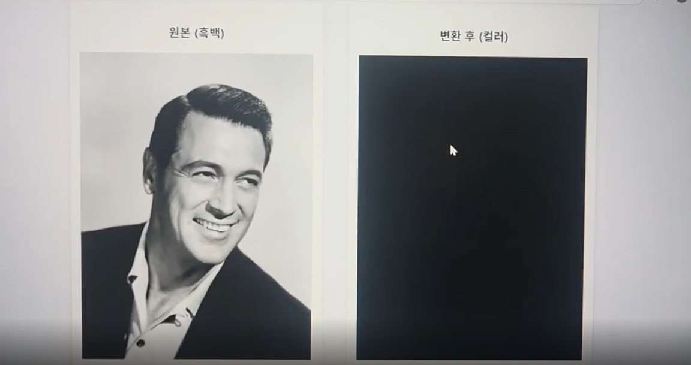

# 🎨 AI 흑백 사진 컬러 복원 보고서 (최종 확장본)

---

# 📌 1. 프로젝트 개요

흑백 사진은 시간의 흐름을 간직하고 있지만 색채 정보가 부족하여 당시의 감정·분위기를 충분히 전달하지 못한다.  
본 프로젝트는 딥러닝 기반 색 복원 기술을 활용하여 흑백 이미지를 고품질 컬러 이미지로 변환하는 데 목적이 있다.

초기에는 **OpenCV Colorization**을 사용했지만, 품질적 한계(저해상도, 문맥 이해 부족, 색 번짐) 때문에  
최종적으로 **DeOldify GAN 기반 모델**을 채택하였다.

---

# 📌 2. 모델 비교 (OpenCV vs DeOldify)

## 🧠 핵심 기술 구조 차이

| 항목 | OpenCV Colorization | DeOldify |
|------|----------------------|----------|
| 기반 기술 | Caffe CNN | GAN / NoGAN (Generator + Discriminator) |
| 색공간 | Lab(L 채널 입력 → a·b 채널 예측) | RGB 기반 문맥 이해 색 생성 |
| 문맥 이해 | 없음 | 뛰어남 |
| 색 품질 | 단조롭고 회색 톤 | 자연스럽고 예술적 |
| 해상도 처리 | 저해상도 중심 | 고해상도 안정 처리 |
| 오류 발생 | 검정 화면 / 색 누락 | 거의 없음 |
| 처리 속도 | 빠름 | 상대적으로 느림 |
| 서비스 적합도 | 낮음 | 매우 높음 |

---

# 📌 3. OpenCV 복원 방식과 한계

### 🔧 작동 방식 요약
- Lab 색공간 변환 후 L 채널만 입력
- 모델이 a·b 색값을 예측
- L + a·b 조합하여 색상을 얹는 단순 방식

### ❌ 한계
- 문맥 이해 불가 → 인물, 배경, 사물을 분리하지 못함  
- 피부/하늘/식물 등 의미 기반 색상 복원이 불가능  
- 고해상도 입력 시 색 반영 실패  
- 아래와 같은 사례(=검정화) 빈번히 발생함



---

# 📌 4. DeOldify 복원 기술과 강점

### ✨ 핵심 기술
- GAN 기반 학습: Generator가 사진을 복원하며 Discriminator가 품질을 평가
- NoGAN 기법: GAN의 불안정성을 줄이고 색 안정성 확보
- ResNet 기반 인코더로 고해상도·고품질 복원 가능

### 🌈 장점
- 자연스럽고 생생한 색감
- 인물 사진 복원 성능 탁월
- 풍경/건물/배경 색조합 현실적
- UI 서비스에 안정적으로 적용 가능


---

# 📌 5. 웹 서비스 흐름 (UI 단계별 이미지 포함)

## ① 업로드 화면


## ② 로딩/처리 화면


## ③ 결과 비교 화면


---

# 📌 7. 기술적 트러블슈팅

### ✔ PyTorch & FastAI 호환성 문제
- 최신 PyTorch는 보안 정책상 pickle 기반 모델 로딩을 제한
- DeOldify는 FastAI 1.x 객체(CALLBACK, HOOK)를 필요로 함  
**해결:** `torch.load()` monkey patching + safe globals 등록

### ✔ GPU 메모리 이슈
- 고해상도 입력 이미지 처리 시 OOM 발생  
**해결:** render_factor 조정 또는 CPU fallback

---

# 📌 8. 프로젝트 디렉토리 구조

```
Colorize-App/
├── app.py
├── model2.py
├── models/
│   ├── ColorizeArtistic_gen.pth
│   └── ColorizeStable_gen.pth
├── model/
│   ├── colorization_deploy_v2.prototxt
│   ├── colorization_release_v2.caffemodel
│   └── pts_in_hull.npy
├── static/
│   └── styles.css
├── templates/
│   └── index.html
├── uploads/
├── result_images/
└── README.md
```

---

# 📌 9. 결론

OpenCV는 빠르고 가볍지만, 현대적 컬러 복원 품질을 충족시키지 못한다.  
반면 DeOldify는 문맥 기반 색 생성 능력과 고품질 결과로 인해  
**서비스용 AI 컬러 복원 모델로 가장 적합한 선택**이다.

---
