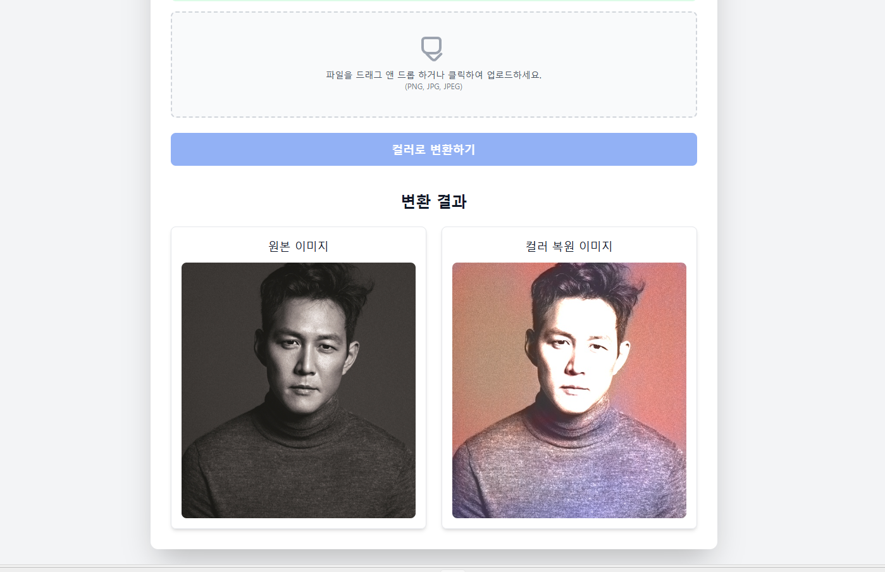
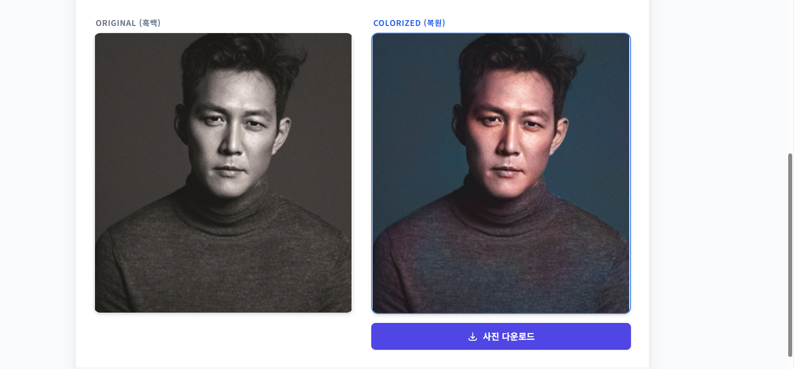
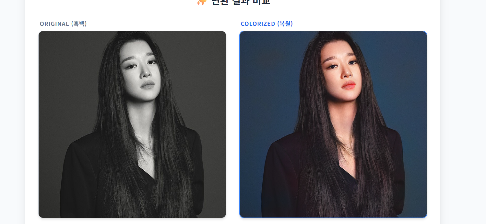
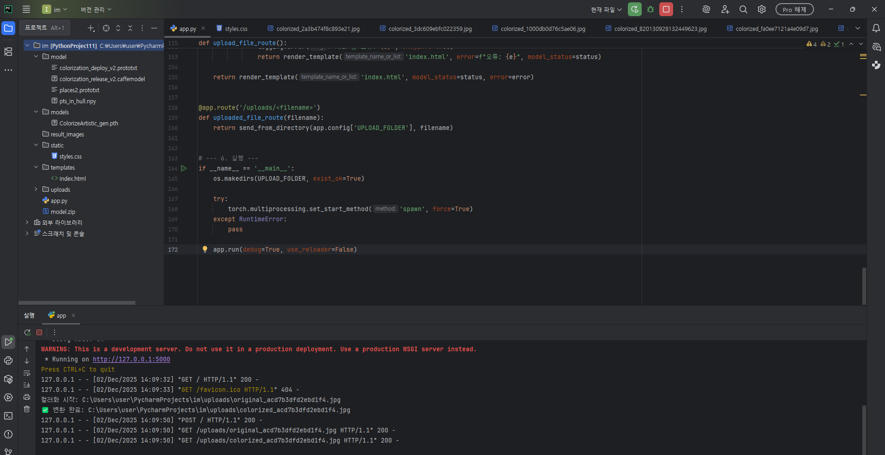
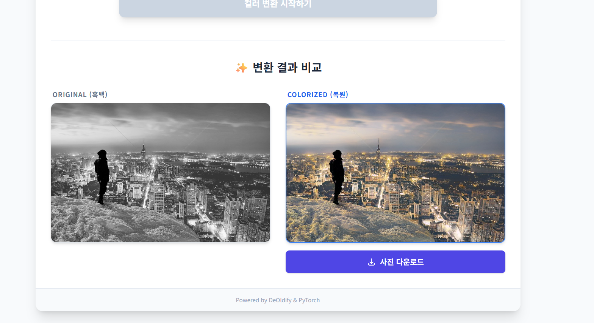

# 🎨 AI 흑백 사진 컬러 복원 웹 애플리케이션  
### *DeOldify vs OpenCV 기반 모델 비교 + 웹 서비스 구현 보고서*

---

# 📌 1. 프로젝트 개요

본 프로젝트는 두 가지 AI 채색 방식을 비교하고, 최종적으로 DeOldify 기반으로 고화질 자동 컬러 복원 웹 서비스를 구축하는 것을 목표로 한다.

## 사용된 두 가지 모델  
### 🔵 (A) OpenCV 딥러닝 기반 Colorization 모델  
- 구조: Caffe 기반 네트워크  
- 파일 구성:  
  - `colorization_release_v2.caffemodel`  
  - `colorization_deploy_v2.prototxt`  
  - `pts_in_hull.npy`  

### 🟣 (B) DeOldify (GAN / NoGAN 기반)  
- ResNet34 기반 Encoder  
- FastAI + PyTorch  
- 고화질(High-Resolution) 예술적(Artistic) 채색 가능  

---

# 📌 2. 비교 모델 소개

## 🔵 (A) OpenCV Colorization (Caffe) 모델  

### 장점  
- 속도가 매우 빠르다.  
- GPU 없어도 빠르게 동작한다.  
- 설치가 간단하다.

### 단점  
- 색이 **전체적으로 탁하게 나옴**  
- 디테일이 부족함  
- 상황 이해(Context)가 약함  
- 아래처럼 **흑백→검정 화면 오류**가 자주 발생함  

---

## 🟣 (B) DeOldify 모델 (최종 선택)  

### 장점  
- 얼굴, 배경, 재질 등 맥락 이해가 매우 뛰어나다  
- 색감이 자연스럽고 풍부하다  
- 고해상도 복원이 가능하다  
- 결과물 품질이 웹 서비스 수준으로 충분히 높다  

### 단점  
- 모델 용량이 크다  
- FastAI 1.x 버전 고정 필요  
- PyTorch 최신 버전과 호환 이슈 존재  
- CPU 단독 사용 시 속도가 느리다  

---

# 📌 3. OpenCV 모델 사용 당시 문제 분석

기존 OpenCV 기반 프로젝트에서는 다음과 같은 문제가 지속 발생했다:

### ⚠️ 문제 1 — 출력 이미지가 검정색으로 나옴  
- BGR-Lab 변환 과정에서 데이터 스케일 오류  
- 모델 Input/Output 텐서 범위 mismatch  
- Caffe 기반 Colormap 적용 문제

### ⚠️ 문제 2 — 사람 얼굴 영역 채색이 매우 부자연스러움  
- GAN 기반이 아니라 픽셀 패턴 기반이라 디테일 부족

### ⚠️ 문제 3 — 고해상도 복원 불가  
- 256px 근처의 해상도 품질 한계

---

# 📌 4. DeOldify 모델 사용 후 개선점

OpenCV 대비 아래와 같은 향상 효과가 나타났다:

| 항목 | OpenCV 모델 | DeOldify 모델 |
|------|-------------|---------------|
| 색감 | 전체적으로 탁함 | 자연스럽고 선명함 |
| 디테일 | 얼굴/피부 처리 약함 | 얼굴 복원 능력이 매우 뛰어남 |
| 고해상도 | 불가 | 가능 |
| 맥락 이해 | 매우 약함 | 매우 강함 |
| 속도 | 빠름 | 상대적으로 느림 |
| 웹 서비스 적합성 | 낮음 | 매우 높음 |

---

# 📌 5. 최종 웹 서비스 구조  

---

# 📸 6. 웹 서비스 UI

## 초기 화면  

## 업로드 + 변환 결과 화면  

## 최종 컬러 복원 결과  

---

# 📌 7. 기술적 문제 해결

## 🔧 FastAI 1.x vs PyTorch 최신 버전 충돌 해결  
- PyTorch 2.x에서 `.pth` 로드 시 pickle 구조 차단됨  
- DeOldify 모델은 pickle 객체 기반이라 오류 발생  

### 해결 전략  
- `torch.load` Monkey-Patching  
- `weights_only=False` 강제 적용  
- `torch.serialization.add_safe_globals`로 필요한 객체 Whitelist 등록  

## 🔧 CUDA/GPU 환경 문제  
- GPU가 없는 환경에서는 inference 속도가 느림 → batch 단위 최적화  
- 이미지 resolution을 단계별 스케일링하여 속도 개선

---

# 📌 8. 결론

OpenCV 기반 컬러 복원은 속도가 빠르다는 점은 장점이지만  
품질이 실 서비스 기준에 미치지 못하여 사용을 중단하였다.

DeOldify 모델은  
- 색감 품질  
- 디테일  
- 맥락 이해 능력  
- 사용자 경험  

모든 면에서 월등하여 **최종 선택 모델**로 결정되었다.

또한 Flask 기반으로 웹 UI를 구성하여  
사용자가 손쉽게 흑백 사진을 업로드하고 결과를 확인할 수 있도록 했다.

---

# ✔ 완성된 README 보고서 파일 생성됨
