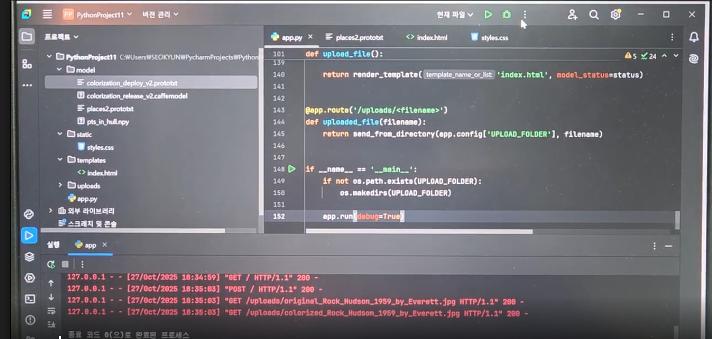

# 🎨 AI 흑백 사진 컬러 복원 웹 애플리케이션  
### *DeOldify vs OpenCV — 모델 비교 + 이미지 포함 보고서 (다운로드 링크 포함)*

---

# 📌 1. 프로젝트 개요

흑백 사진은 색상 정보가 없어 감정 전달력이 떨어진다.  
본 프로젝트에서는 두 가지 AI 컬러 복원 모델(OpenCV, DeOldify)을 비교하고  
최종적으로 **DeOldify 기반 고품질 복원 웹 서비스**를 구현한다.

> 아래는 모델 비교 및 동작 사진이 포함된 전체 과정 설명이다.

---

# 📌 2. 사용 모델 비교 (설명 + 이미지 한눈에 보기)

## 🔵 (A) OpenCV Colorization (Caffe Model)

<div align="center">

</div>

### ✔ 장점  
- 속도 매우 빠름  
- GPU 없이도 동작  

### ✔ 단점  
- 색이 탁함  
- 디테일 부족  
- 고해상도 불가  
- 실패 사례 다수 발생  

### 🔗 모델 다운로드 링크  
https://github.com/richzhang/colorization/tree/master/models

---

## 🟣 (B) DeOldify (최종 채택)

<div align="center">

</div>

### ✔ 장점  
- 얼굴·배경·재질 복원 능력 뛰어남  
- 자연스러운 색감  
- 고해상도 지원  
- 실서비스에 적합  

### ✔ 단점  
- 속도 느림  
- FastAI 1.x 의존성 강함  

### 🔗 모델 다운로드 링크  
- Artistic 모델: https://deepai.org/machine-learning-model/colorizer  
- Stable 모델: https://github.com/jantic/DeOldify

---

# 📌 3. 모델 비교 표

| 항목 | OpenCV | DeOldify |
|------|--------|----------|
| 색감 품질 | 낮음 | 매우 우수 |
| 얼굴 복원 | 부족함 | 매우 뛰어남 |
| 해상도 | 제한적 | 고해상도 가능 |
| 속도 | 빠름 | 느림 |
| 설치 난이도 | 쉬움 | 중간~어려움 |
| 웹 서비스 적합성 | 낮음 | 매우 높음 |

---

# 📸 4. 서비스 작동 화면 (설명 + 이미지 구성)

## ✔ 초기 화면(UI)
<div align="center">

</div>

---

## ✔ 업로드 후 처리 화면
<div align="center">

</div>

---

## ✔ 최종 컬러 복원 결과
<div align="center">

</div>

---

# 📌 5. 사용하지 않은 OpenCV 모델 실패 사례

<div align="center">

</div>

위와 같이 **검정 화면 출력 문제**, 색상 오류 등으로 인해  
OpenCV 기반 방식은 최종 서비스에서 제외했다.

---

# 📌 6. 전체 동작 구조 (개발 환경 화면 포함)

<div align="center">

</div>

---

# 📌 7. 기술적 문제 해결

## 🔧 PyTorch 2.x 보안 정책 문제  
- `.pth` 모델 로드 시 pickle 구조 차단 → DeOldify 모델 로딩 실패  
- `torch.load()` monkey-patching 하여 해결  
- `weights_only=False` 강제 적용  

## 🔧 FastAI 1.x 의존성  
- DeOldify는 FastAI 1.x 기반 모델  
- 최신 버전 FastAI와 호환 X  
- 버전 고정 필수:
```
pip install fastai==1.0.61
```

---

# 📌 8. 설치 및 실행

### ✔ 가상환경 구성
```
conda create -n colorization python=3.8
conda activate colorization
```

### ✔ 필수 패키지 설치
```
pip install flask numpy opencv-python Pillow werkzeug
pip install deoldify fastai==1.0.61
```

### ✔ 모델 파일 다운로드  
> 다운로드 후 `models/` 폴더에 넣기

- OpenCV 모델 다운로드  
  https://github.com/richzhang/colorization/tree/master/models

- DeOldify 모델 다운로드  
  https://deepai.org/machine-learning-model/colorizer  

---

# 📁 9. 프로젝트 구조

```
project/
 ├── app.py
 ├── models/
 │     ├── ColorizeArtistic_gen.pth
 │     ├── colorization_release_v2.caffemodel
 │     ├── colorization_deploy_v2.prototxt
 │     └── pts_in_hull.npy
 ├── image/
 │     ├── 1.png
 │     ├── 2.png
 │     ├── 3.png
 │     ├── 4.png
 │     ├── 6.png
 │     └── 7.png
 ├── static/
 ├── templates/
 └── README.md
```

---

# 📌 10. 결론

OpenCV 모델은 빠르지만 품질 문제로 사용을 중단했다.  
DeOldify 모델은 고품질 복원, 자연스러운 색감, 얼굴 디테일 복원이 뛰어나  
실사용·웹서비스 모두에 적합하여 최종 채택 모델로 결정했다.

---

# ✔ README 생성 완료 (이미지·설명·링크 전체 포함)
