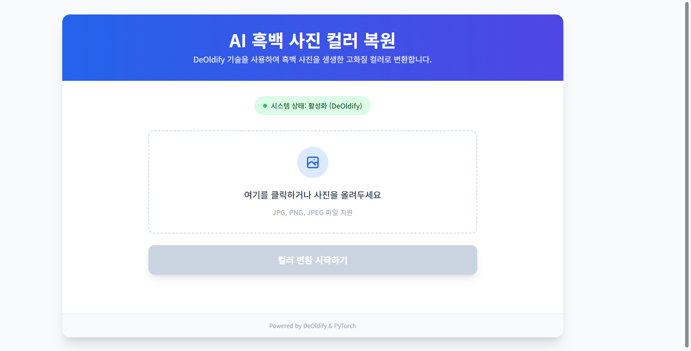
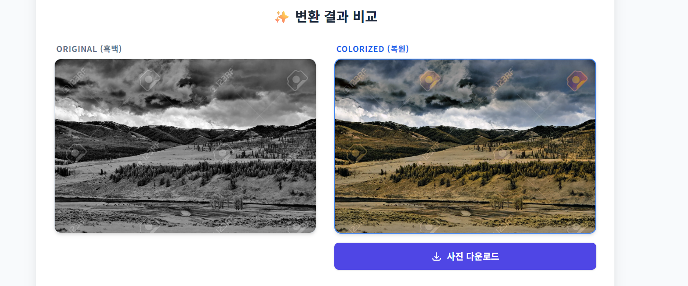

# 🎨 AI 흑백 사진 컬러 복원 웹 애플리케이션  
### *DeOldify + Flask 기반 이미지 자동 색채 복원 서비스*

---

# 📌 1. 프로젝트 개요

오래된 흑백 사진은 색상이 없어 당시의 분위기나 감정 전달력이 낮다.  
본 프로젝트는 DeOldify GAN 모델을 활용해 흑백 이미지를 **고품질 컬러 이미지로 자동 변환하는 웹 서비스**를 구축하는 것이다.

---

# 📌 2. 배경 및 필요성

- 흑백 사진이 가진 정보적 한계를 보완한다.  
- AI 기반 복원 기술을 웹 환경에서 누구나 쉽게 사용할 수 있도록 한다.  
- DeOldify 모델을 최신 환경(Python, PyTorch)에서 안정적으로 구동시키기 위한 기술적 해결 과정이 의미 있다.

---

# 📌 3. 주요 기능

## ✔ 이미지 업로드  
이미지 파일(JPG, PNG 등)을 서버에서 받아 모델 입력 형태로 전처리한다.

## ✔ AI 기반 자동 컬러 복원  
DeOldify 모델이 회색조 픽셀의 패턴과 맥락을 분석해 자연스러운 색상을 생성한다.

## ✔ 결과 비교  
흑백 원본과 컬러 복원본을 나란히 보여준다.

## ✔ 고화질 결과 다운로드  
최종 결과를 이미지 파일로 다운로드할 수 있다.

---

# 📌 4. 기술 스택

### Backend
- Python  
- Flask  
- OpenCV  
- NumPy  

### AI / Deep Learning
- **DeOldify** (NoGAN 기반)  
- FastAI 1.x  
- PyTorch  

### Frontend
- HTML5, CSS3  
- Tailwind CSS  

---

# 📌 5. 설치 및 실행 방법

## ✔ 1) 가상환경 구성
```
conda create -n colorization python=3.8
conda activate colorization
```

## ✔ 2) 필수 패키지 설치
```
pip install flask numpy opencv-python Pillow werkzeug
pip install deoldify fastai==1.0.61
```

※ fastai는 반드시 1.0.61 버전을 사용해야 한다.

## ✔ 3) 모델 가중치 다운로드
파일명:
```
ColorizeArtistic_gen.pth
```
→ `models/` 디렉토리에 저장한다.

## ✔ 4) 실행
```
python app.py
```
브라우저 접속:
```
http://127.0.0.1:5000
```

---

# 📌 6. 기술적 문제 해결(트러블슈팅)

## 🔧 Issue 1 — PyTorch 보안 정책 변경으로 인한 모델 로딩 오류  
PyTorch 2.6 이후 `.pth` 로드 시 pickle 형태의 객체 로딩이 차단되어  
구버전 FastAI 기반 DeOldify 모델이 정상 로드되지 않는다.

### 해결:
- `torch.load`에 대해 Monkey-Patching  
- `weights_only=False` 강제 지정  
- `torch.serialization.add_safe_globals`로 필요한 클래스 목록 Allowlist 등록

---

## 🔧 Issue 2 — fastai 최신 버전 비호환  
fastai 최신 버전은 DeOldify 내부 API와 구조가 달라 실행되지 않는다.

### 해결:  
```
pip install fastai==1.0.61
```
으로 버전 고정(pinning)하여 문제 해결.

---

# 📸 7. 서비스 화면 예시

## ✔ 첫 화면  


## ✔ 로딩 화면  


## ✔ 결과 화면  


---

# 📌 8. 향후 발전 방향

### 🟣 흑백 영상 컬러 복원  
프레임 단위로 컬러 복원 후 다시 합성하는 기능 개발 예정

### 🟣 모델 선택 옵션 제공  
- Artistic 모델  
- Stable 모델  
사용자가 선택 가능하도록 확장

### 🟣 클라우드 서비스화  
Docker를 활용해 AWS·GCP에 배포하고 외부 접속 허용 서비스로 확장 예정

---

# 📁 프로젝트 구성

```
project/
 ├── app.py
 ├── models/
 │     └── ColorizeArtistic_gen.pth
 ├── static/
 ├── templates/
 ├── image/
 │     ├── 1.png
 │     ├── 2.png
 │     └── 3.png
 └── README.md
```

---

# ✔ README 파일 생성됨

